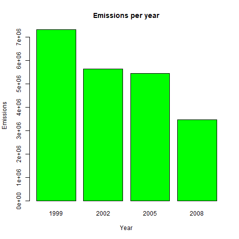
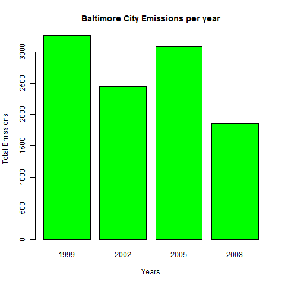
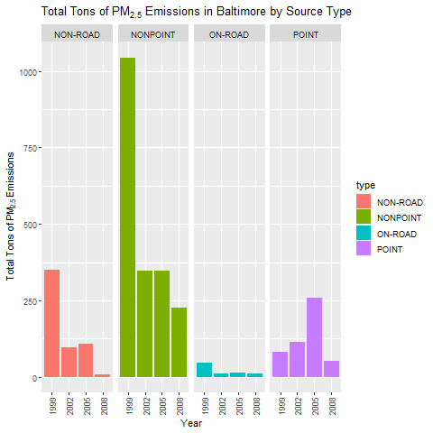
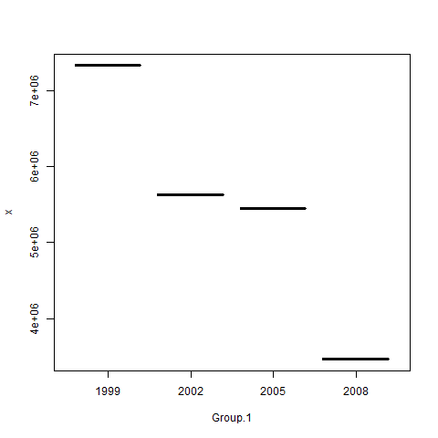
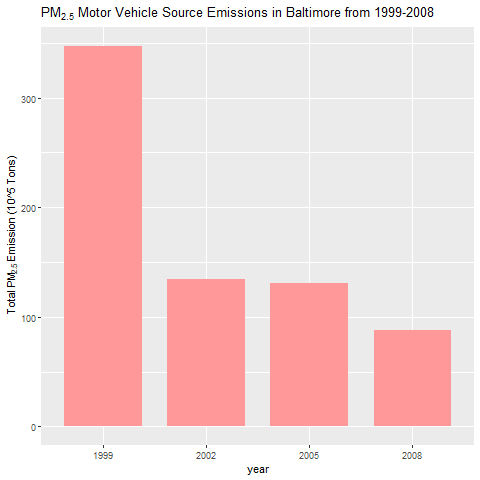
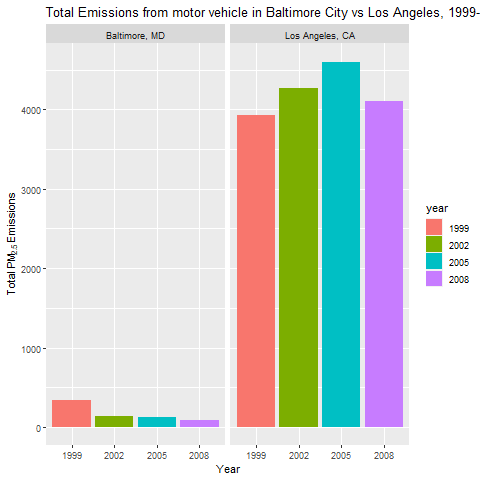

Exploratory Analysis of the EPA's National Emissions Inventory Data

This project explored fine particulate matter emissions in the US using the R package dplyr for analysis and the different graphics packages in R: base, lattice, and ggplot2. It was the second project for Exploratory Data Analysis.

## Documentation

Fine particulate matter (PM2.5) is an ambient air pollutant for which there is strong evidence that it is harmful to human health. In the United States, the Environmental Protection Agency (EPA) is tasked with setting national ambient air quality standards for fine PM and for tracking the emissions of this pollutant into the atmosphere. Approximatly every 3 years, the EPA releases its database on emissions of PM2.5. This database is known as the National Emissions Inventory (NEI). You can read more information about the NEI at the EPA National Emissions Inventory web site.

For each year and for each type of PM source, the NEI records how many tons of PM2.5 were emitted from that source over the course of the entire year. The data that you will use for this assignment are for 1999, 2002, 2005, and 2008.
[Data Source](https://d396qusza40orc.cloudfront.net/exdata%2Fdata%2FNEI_data.zip)

- **fips**: A five-digit number (represented as a string) indicating the U.S. county
- **SCC**: The name of the source as indicated by a digit string (see source code classification table)
- **Pollutant**: A string indicating the pollutant
- **Emissions**: Amount of PM2.5 emitted, in tons
- **type**: The type of source (point, non-point, on-road, or non-road)
- **year**: The year of emissions recorded

Q1.Have total emissions from PM2.5 decreased in the United States from 1999 to 2008?
Using the base plotting system, make a plot showing the total PM2.5 emission from all 
sources for each of the years 1999, 2002, 2005, and 2008.

Observation:    
Yes, total emissions from PM2.5 decreased in the United States from 1999 to 2008

Q2.Have total emissions from PM2.5 decreased in the Baltimore City, 
Maryland fips == "24510") 
from 1999 to 2008? Use the base plotting system to make a plot answering this question.

Observation:
Yes.There is an absolute decrease from the year 1999 to the year 2008 in total PM2.5 emissions in Baltimore City.

Q3.Of the four types of sources indicated by the type (point, nonpoint, onroad, nonroad) variable,
which of these four sources have seen decreases in emissions from 1999-2008
for Baltimore City? Which have seen increases in emissions from 1999-2008? 
Use the ggplot2 plotting system to make a plot answer this question.

Observation:
on-road, non-road, and non-point sources have all seen decreases in PM2.5 emissions from 1999-2008
whereas point sources have seen an increase over the same time period.

Q4.Across the United States, how have emissions from coal combustion-related 
sources changed from 1999-2008?

Observation:
Emissions from coal combustion-relates sources have decreased from 1999-2008.

Q5.How have emissions from motor vehicle sources changed from 1999-2008 in Baltimore City?

Observation:
Emissions from motor vehicle sources have declined from 1999-2008 in Baltimore City.

Q6.Compare emissions from motor vehicle sources in Baltimore City with
emissions from motor vehicle sources in Los Angeles County, California
fips == "06037". Which city has seen greater changes over time in motor vehicle emissions?
Gather the subset of the NEI data which corresponds to vehicles.

Observation:
Motor vehicle emissions have declined in Baltimore City and increased in Los Angeles.